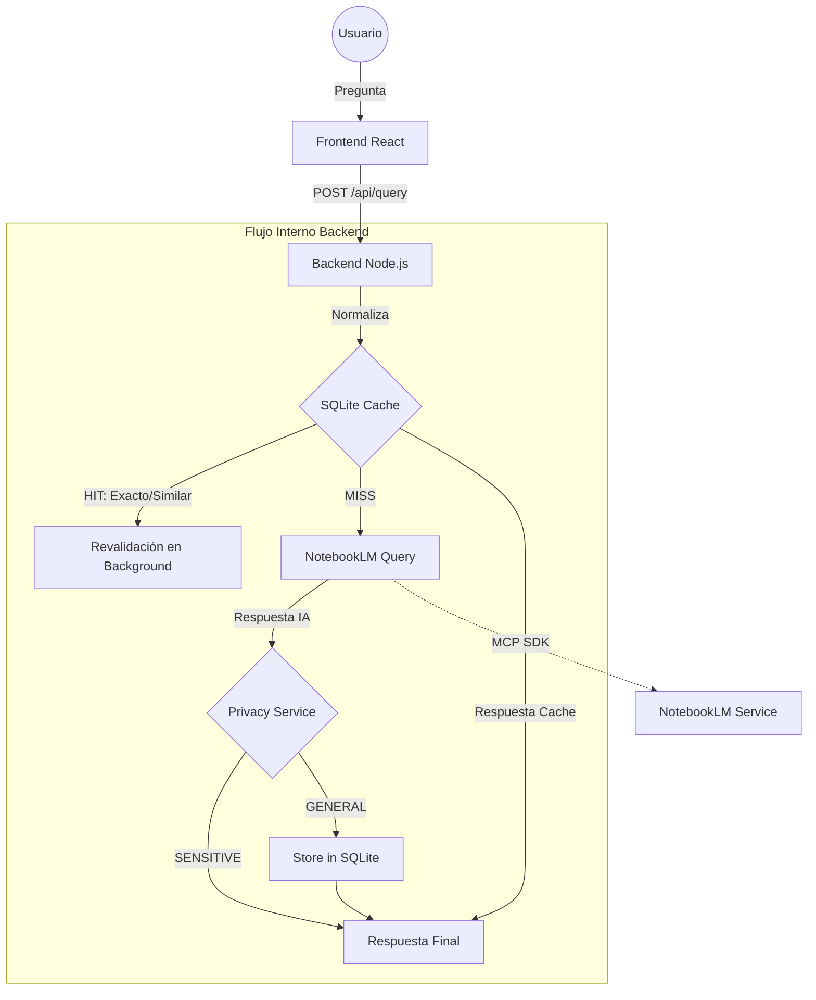

# Documentación Técnica de Arquitectura: Asistente RRHH Plastitec (IA)

Este documento detalla la arquitectura, el funcionamiento interno y la integración de servicios del **Asistente de Recursos Humanos de Plastitec**, una solución híbrida de inteligencia artificial diseñada para automatizar consultas sobre el Reglamento Interno de Trabajo (RIT) y políticas corporativas.

---

## 1. RESUMEN GENERAL DEL SISTEMA

### Descripción del Proyecto
El **Asistente RRHH Plastitec** es una aplicación web progresiva (PWA) que permite a los colaboradores realizar consultas en lenguaje natural sobre normativas internas. Utiliza un motor híbrido que combina una base de conocimientos local (SQLite) con un motor de razonamiento avanzado (NotebookLM vía MCP).

### Objetivo Principal
Proporcionar respuestas precisas, inmediatas y validadas a las dudas de RRHH, reduciendo la carga operativa del departamento y garantizando la consistencia en la información entregada.

### Arquitectura General (Alto Nivel)
El sistema sigue un patrón **Cliente-Servidor (SPA/Node.js)** con una capa intermedia de servicios especializados:
- **Frontend**: Single Page Application (React + Vite) optimizada para dispositivos móviles (Quioscos).
- **Backend**: API REST (Node.js/Express) que orquestra la lógica de negocio y seguridad.
- **Capa Híbrida**: 
    - **Caché Persistente**: SQLite para respuestas frecuentes y alta disponibilidad.
    - **IA Externa**: NotebookLM para consultas complejas y procesamiento de lenguaje natural.

---

## 2. ARQUITECTURA GENERAL

### Diagrama Lógico de Flujo

---

## 3. BACKEND (Node.js)

### Estructura de Proyecto
- `server.js`: Punto de entrada y orquestador de rutas API.
- `/services/database.js`: Lógica de persistencia y búsqueda fuzzy.
- `/services/privacy.js`: Filtro de seguridad PII (Información Personal Identificable).
- `/dist/`: Frontend compilado servido de forma estática.

### Endpoint Principal: `/api/query`
Es el corazón del sistema. Su flujo interno es el siguiente:
1. **Normalización**: Limpia la pregunta (acentos, signos, minúsculas).
2. **Consulta SQLite**: Busca una coincidencia exacta o similar (Threshold > 0.85).
3. **Manejo de Hits**: Si hay coincidencia, responde inmediatamente. Si el registro está desactualizado (`knowledge_version`), dispara una revalidación asíncrona.
4. **Consulta IA**: Si no hay caché, consulta a NotebookLM mediante el protocolo MCP.
5. **Aprendizaje Progresivo**: Si la respuesta de la IA es válida y segura (no sensitiva), se persiste en SQLite para futuras consultas.

### Sistema de Aprendizaje Progresivo
Funciona mediante la acumulación de métricas y validación automática:
- **`usage_count`**: Cada vez que se usa una respuesta (sea de caché o IA), se incrementa su contador.
- **FAQ Validadas**: Cuando una pregunta alcanza un umbral de frecuencia (configurable, por ejemplo 10 usos), se marca como `faq_validated=1` y aparece en el Dashboard Admin con prioridad alta.
- **Revalidación Automática**: Si se incrementa la `knowledge_version` global (al cargar nuevos documentos en NotebookLM), el sistema detecta registros antiguos y los vuelve a consultar a la IA en segundo plano (background) para actualizar la caché sin que el usuario lo note.

---

## 4. DATABASE (SQLite)

### Estructura de Tabla `knowledge_base`
| Campo | Tipo | Función |
| :--- | :--- | :--- |
| `question_original` | TEXT | La pregunta tal cual la escribió el usuario. |
| `question_normalized` | TEXT (UNIQUE) | Versión limpia para búsquedas rápidas. |
| `answer` | TEXT | La respuesta generada por la IA o corregida. |
| `usage_count` | INTEGER | Veces que se ha entregado esta respuesta. |
| `faq_validated` | INTEGER | Flag (0/1) que indica si es una FAQ oficial. |
| `knowledge_version` | INTEGER | Versión de la fuente de datos con la que se generó. |
| `last_validated` | DATETIME | Fecha del último chequeo contra la IA. |

### Lógica de Búsqueda
Utiliza el **Coeficiente de Dice** para comparar la similitud entre cadenas. Esto permite que preguntas como "¿Horarios de oficina?" y "¿A qué hora abren la oficina?" coincidan con la misma respuesta si el puntaje de similitud es alto.

---

## 5. INTEGRACIÓN CON NOTEBOOKLM

- **Protocolo MCP (Model Context Protocol)**: Proporciona una conexión de baja latencia con el motor de Google.
- **Doble Validación**: 
    - El sistema utiliza un **Prompt de Persona** corporativo para asegurar el tono.
    - Si NotebookLM indica que no tiene información, el backend intenta una **reformulada automática** (Accuracy Boost) para agotar las posibilidades de búsqueda antes de dar una respuesta negativa.
- **Fuente Viva**: NotebookLM es considerado la fuente de verdad absoluta. SQLite solo "aprende" lo que NotebookLM dictamina, actuando como una "memoria rápida".

---

## 6. FRONTEND (React)

### Flujo de Usuario
1. El usuario interactúa mediante voz o texto.
2. El componente `VoiceChat.jsx` gestiona la máquina de estados: `IDLE` → `LISTENING` → `PROCESSING` → `RESPONDING`.
3. **Dashboard Access**: Se implementó una puerta trasera de seguridad: al hacer clic **5 veces** en el logo superior, se activa un modal para ingresar un **PIN de acceso**.

### Compatibilidad
- **Diseño Mobile-First**: Optimizado para tabletas en quioscos fijos.
- **PWA**: Instalable en Android/iOS con soporte para iconos y pantalla completa (manifest.json).

---

## 7. ⚡ ADMIN DASHBOARD

### Seguridad
- **PIN Backend-Only**: La verificación del PIN ocurre en el servidor (`/api/verify-pin`). El hash no está expuesto en el código del frontend.
- **Protección de Rutas**: Los endpoints de administración devuelven datos solo si se ha validado la sesión o el PIN.

### Funcionalidades
- **Métricas de Conocimiento**: Muestra cuántas FAQs ha aprendido el sistema.
- **Forzar Revalidación**: El administrador puede "invalidar" la caché actual (incrementando `knowledge_version`) para obligar al sistema a refrescar todas las respuestas contra la última versión de los documentos cargados.

---

## 8. CONFIGURACIÓN Y VARIABLES CLAVE

- **`PORT`**: 3000 (Backend).
- **`ALLOWED_ORIGINS`**: Lista de dominios permitidos para CORS.
- **`NOTEBOOK_ID`**: Identificatorio único del cuaderno de RRHH en NotebookLM.
- **`ADMIN_PIN_HASH`**: Firma segura para validación de acceso administrativo.

---

## 9. FLUJO COMPLETO DE UNA PREGUNTA (Ejemplo)

1. **Usuario**: "¿Cuántos días tengo de vacaciones?"
2. **Frontend**: Envía consulta a `/api/query`.
3. **Backend**: Normaliza → En SQLite encuentra pregunta similar (95% match).
4. **Caché**: Devuelve la respuesta guardada inmediatamente.
5. **Background**: Detecta que la respuesta es de la `v0`. Dispara consulta a AI silenciosamente.
6. **AI**: Responde lo mismo pero con un detalle nuevo sobre el RIT 2026.
7. **SQLite**: Detecta el cambio, actualiza el registro e incrementa la versión.
8. **Resultado**: El usuario recibió la respuesta en <50ms, y el sistema se actualizó "solo".

---

## 10. ESTADO ACTUAL Y RECOMENDACIONES

- **Madurez**: El sistema es estable y posee una arquitectura resiliente a fallas de red (gracias al Fallback de SQLite).
- **Fortalezas**: Aprendizaje automático, búsqueda por similitud y protección de datos sensibles.
- **Riesgos**: Dependencia de la sesión de NotebookLM (requiere re-auth periódica).
- **Recomendaciones**: Implementar un sistema de corrección manual de respuestas desde el dashboard para que RRHH tenga control editorial sobre lo que la IA "aprende".

---
*Documento generado por la Arquitectura de Sistemas - 2026*
